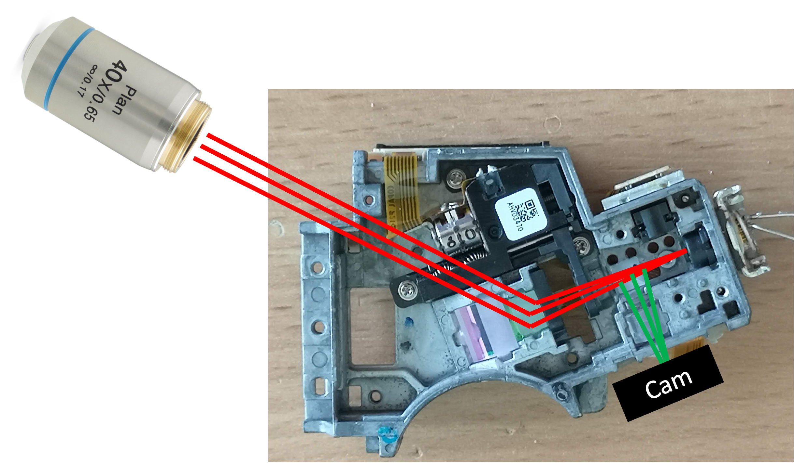

# Hackathon: Building an Affordable Hardware-Based Autofocus System for Microscopy

Welcome to the BluFocus Hackathon! In this hackathon, we will be addressing the crucial need for a hardware-based autofocus system that can revolutionize microscopy by ensuring slide scanning without focus loss, enabling long timelapse imaging series without focus drift, and compensating for temperature drift in microscopes.

## Motivation

Autofocus is a critical feature in microscopy as it helps to keep the sample in focus, resulting in high-quality imaging. Currently, there are software-based autofocus systems that maximize contrast based on the z-position of the sample or objective. However, hardware-based autofocus systems provide alternative solutions. These systems typically utilize a laser coupled into the detection path, reflecting off the sample (e.g., coverslip), and reaching a detector (e.g., quadrant diode, camera) via a beamsplitter. As the sample moves along the optical axis, the detected beam on the detector changes as a function of *z*, which can be processed using various techniques or electric circuits.

While some major microscope manufacturers offer hardware-based autofocus systems, they tend to be expensive. Software-based systems, on the other hand, are slow and lack real-time functionality. Although neural network-based systems show promise, they are not yet stable enough. Thus, there is a clear need for an open-source hardware-based autofocus system that is affordable, precise, and accessible to anyone.

For further reading on the topic, we recommend the review article "Advances in Hardware Autofocus Systems for Microscopy" available at: [Link to Article](https://arxiv.org/pdf/2006.08610.pdf)

## Goal

The primary objective of this hackathon is to build an affordable hardware module for autofocus using readily available components, namely the optical pickup unit (OPU) from a PS3 Bluray drive and the SEEED XIAO ESP32-S3 Camera. The PS3 OPU employs an astigmatism-based autofocus technique, which maintains a constant distance between the disk and the detection lens. To replicate this functionality, we will replace the quadrant diode with a camera and utilize image processing algorithms, either on the ESP32 microcontroller or in Python, to compute the astigmatism as a function of the focus along the z-axis.

Ultimately, the goal is to create a hardware module capable of continuously tracking the focus and providing a signal to a motor, ensuring that the focus remains constant during microscopy experiments.

## Background

The use of optical pickup units (OPUs) from Bluray/HD-DVD players has been extensively explored in various applications, including force measurements, atomic force microscopy, nanoprinting, and laser scanning microscopy. These OPUs are highly integrated photonic devices with immense potential. If you're interested in delving deeper into OPU hacking, there are informative forum discussions available at: [Link to Forum](https://forum.hackteria.org/t/laser-optical-pickup-unit-hacking/771/24)

To gain a comprehensive understanding, we recommend watching this enlightening video: [Link to Video](https://www.youtube.com/watch?v=5bqujaldaCQ&ab_channel=EdwinHwu)

For a concise summary of OPU hacking, you can refer to this document: [Link to Summary](https://drive.google.com/file/d/1NFffRgITiLQYtSXz-uS6AOUKJFVFwoh7/view)

OPUs are widely available in large quantities as discarded electronic components, making them an ideal resource for hacking and repurposing.

The SEEED XIAO ESP32-S3 Camera, integrated with the ESP32 microcontroller, provides a convenient solution for streaming images over USB or Wi-Fi. Also, the microcontroller has enough power to do basic image processing such as gaussian bluring, min/max estimation, etc. Enough to evtl. do the focus computation on the device before transmitting the information to e.g. a computer.

## Current State: Building the Prototype

At present, we have a functional prototype that combines the SEEED XIAO ESP32-S3 camera (OV2640 chip) with the PS3 OPU (KES400A) for the autofocus system. During the prototyping phase, we utilize a red diode (650nm) instead of UV (405nm) or IR (850nm) to facilitate beam visibility. However, using NIR (near-infrared) diodes would be more suitable for fluorescence excitation and maintaining invisibility.

To modify the OPU, we remove the focusing lens and quadrant diode. In place of the quadrant diode, we position the camera without its lens to detect the astigmatism. This assembly is attached to a microscope objective lens, and a simple coverslip serves as a beamsplitter. The beam from the OPU to the objective lens' back focal plane (BFP) is collimated. Ideally, the camera should be confocal with the sample plane. The entire assembly takes the form of a cube, with the mirror adjustable to ensure it hits the BFP in the center and remains parallel to the optical axis.

To protect the camera (or flatband cable) from immediate damage, we use a camera with a long cable.

The simplest prototype involves replacing the diode with the camera and substituting the read-out lens with the objective lens.

### Setting up and Adapting

To disassemble the OPU, you can remove the metal plate at the back and the detection lens using Philips screwdrivers.

The back of the OPU features a complex and precisely adjusted "confocal" microscope:


*Bottom View*

To attach this unit to a 3D printed assembly, we will enlarge the holes where the lens used to be, making them M3-sized, and then incorporate the assembly into a UC2 insert:


The Xiao camera module can be adapted using another 3D printed mechanism (customizable to your needs). It's worth noting that the astigmatism is not parallel to the case of the OPU, so it may be necessary to adjust the angle by rotating the camera. Additionally, the focus may be slightly closer than the plastic cap (black) of the camera module allows.


We create an initial prototype as follows:


It is advisable to mount the XIAO camera securely to prevent damage to the flatband cable:


The laser diode can be directly powered by the 3V3 supply voltage or controlled using a transistor for on/off switching in the code.


### Optical Setup

The optical setup for the autofocus system involves several components and configurations. Here is an overview of the setup:



- Laser Collimation: The laser beam is roughly collimated using a lens that also features a grating. The purpose of the grating is yet to be determined.
- Spatial Light Modulator (SLM): The laser beam passes through a tiny SLM, which shapes the beam according to specific requirements.
- Polarizing Beam Splitters: The shaped beam is directed through two polarizing beam splitters before it is steered towards the objective lens.
- Polarization Rotation: The reflected light from the sample undergoes polarization rotation using a quarter-wave plate.
- Detection: The polarizing beam splitter reflects the light towards the detector. Between the beamsplitter and the detector, a small grating is positioned along with a negative cylindrical lens.
- Grating and Negative Cylindrical Lens: The combination of the grating and negative cylindrical lens plays a crucial role in the autofocus system:
  - A collimated beam results in a cross or the best-focused image on the detector.
  - An out-of-focus beam leads to a line structure along the x or y axis, depending on whether it is positively or negatively out of focus.
  - Typically, a quadrant detector is used to measure the differences between the sums of intensities (A-B)+(C-D).
  - The resulting S-curve can be used for absolute or relative focus tracking in a linear regime.
  - The S-curve switches signs at the outer regions because the astigmatism rotates as a function of atan2.


The practical implementation of this setup may look like the following animation:


The combination of these optical elements allows for precise detection and tracking of focus in the autofocus system.

### Code

The general code is divided into two pieces:
- cpp code that can be used in the aRduino IDE or better Platform.io in Visual studio code that reads out the camera, sets up expsoure and gain and converts the data to a byte stream to send it out via Serial
- python code to send data (E.g. request frame, setup camera parameter), receive the data and converts it to numpy arrays

The code is copied from our matchboxscope repository:
https://github.com/Matchboxscope/matchboxscope-simplecamera/tree/autofocus


#### ESP32


```cpp
#include "esp_camera.h"
#include <base64.h>

#define BAUD_RATE 2000000

#define PWDN_GPIO_NUM -1
#define RESET_GPIO_NUM -1
#define XCLK_GPIO_NUM 10
#define SIOD_GPIO_NUM 40
#define SIOC_GPIO_NUM 39


#define Y9_GPIO_NUM 48
#define Y8_GPIO_NUM 11
#define Y7_GPIO_NUM 12
#define Y6_GPIO_NUM 14
#define Y5_GPIO_NUM 16
#define Y4_GPIO_NUM 18
#define Y3_GPIO_NUM 17
#define Y2_GPIO_NUM 15
#define VSYNC_GPIO_NUM 38
#define HREF_GPIO_NUM 47
#define PCLK_GPIO_NUM 13

#define LED_GPIO_NUM 21

void grabImage();
void cameraInit();

void setup()
{
  Serial.begin(BAUD_RATE);
  Serial.setTimeout(20);
  cameraInit();
}

int Nx = 320;
int Ny = 240;
int Nroi = 50;
int x = 320 / 2;
int y = 240 / 2;
bool isStreaming = true;

/* setting expsorue time: t1000
setting gain: g1
getting frame: c */
void loop()
{
  // Check for incoming serial commands
  if (Serial.available() > 0)
  {
    String command = Serial.readString(); // Read the command until a newline character is received

    Serial.println(command);                       // Print the command (debugging

    if (command.length() > 1 && command.charAt(0) == 't')
    {
      // exposure time
      int value = command.substring(1).toInt(); // Extract the numeric part of the command and convert it to an integer
      // Use the value as needed
      // Apply manual settings for the camera
      sensor_t *s = esp_camera_sensor_get();
      s->set_gain_ctrl(s, 0);              // auto gain off (1 or 0)
      s->set_exposure_ctrl(s, 0);          // auto exposure off (1 or 0)
      s->set_aec_value(s, value);      // set exposure manually (0-1200)
    }
    else if (command.length() > 1 && command.charAt(0) == 'g')
    {
      // gain
      int value = command.substring(1).toInt(); // Extract the numeric part of the command and convert it to an integer

      // Apply manual settings for the camera
      sensor_t *s = esp_camera_sensor_get();
      s->set_gain_ctrl(s, 0);              // auto gain off (1 or 0)
      s->set_exposure_ctrl(s, 0);          // auto exposure off (1 or 0)
      s->set_agc_gain(s, value);           // set gain manually (0 - 30)

    }
    else
    {
      // capture image and return
      grabImage();
    }

    // flush serial
    while (Serial.available() > 0)
    {
      char c = Serial.read();
    }
  }
}

void cameraInit()
{

  camera_config_t config;
  config.ledc_channel = LEDC_CHANNEL_0;
  config.ledc_timer = LEDC_TIMER_0;
  config.pin_d0 = Y2_GPIO_NUM;
  config.pin_d1 = Y3_GPIO_NUM;
  config.pin_d2 = Y4_GPIO_NUM;
  config.pin_d3 = Y5_GPIO_NUM;
  config.pin_d4 = Y6_GPIO_NUM;
  config.pin_d5 = Y7_GPIO_NUM;
  config.pin_d6 = Y8_GPIO_NUM;
  config.pin_d7 = Y9_GPIO_NUM;
  config.pin_xclk = XCLK_GPIO_NUM;
  config.pin_pclk = PCLK_GPIO_NUM;
  config.pin_vsync = VSYNC_GPIO_NUM;
  config.pin_href = HREF_GPIO_NUM;
  config.pin_sscb_sda = SIOD_GPIO_NUM;
  config.pin_sscb_scl = SIOC_GPIO_NUM;
  config.pin_pwdn = PWDN_GPIO_NUM;
  config.pin_reset = RESET_GPIO_NUM;
  config.xclk_freq_hz = 20000000;
  // config.frame_size = FRAMESIZE_QVGA;
  // config.pixel_format = PIXFORMAT_JPEG; // for streaming
  // config.pixel_format = PIXFORMAT_RGB565; // for face detection/recognition
  config.grab_mode = CAMERA_GRAB_WHEN_EMPTY;
  config.fb_location = CAMERA_FB_IN_PSRAM;
  config.jpeg_quality = 12;

  config.pixel_format = PIXFORMAT_JPEG;
  config.frame_size = FRAMESIZE_QVGA; // for streaming}

  config.fb_count = 1;

  esp_err_t err = esp_camera_init(&config);
  if (err != ESP_OK)
  {
    return;
  }

  sensor_t *s = esp_camera_sensor_get();
  s->set_hmirror(s, 1);
  s->set_vflip(s, 1);
}
void grabImage()
{

  camera_fb_t *fb = esp_camera_fb_get();

  if (!fb || fb->format != PIXFORMAT_JPEG)
  {
    Serial.println("Failed to capture image");
  }
  else
  {
    delay(40);

    String encoded = base64::encode(fb->buf, fb->len);
    Serial.write(encoded.c_str(), encoded.length());
    Serial.println();
  }

  esp_camera_fb_return(fb);
}
```


#### PYTHON

```py
#%%
import serial
import time
import serial.tools.list_ports
from PIL import Image
import base64
import io
import numpy as np
import matplotlib.pyplot as plt
import tifffile as tif

import cv2

def connect_to_usb_device(manufacturer):
    ports = serial.tools.list_ports.comports()
    for port in ports:
        if port.manufacturer == manufacturer or port.manufacturer == "Microsoft":
            try:
                ser = serial.Serial(port.device, baudrate=2000000, timeout=1)
                print(f"Connected to device: {port.description}")
                ser.write_timeout = 1
                return ser
            except serial.SerialException:
                print(f"Failed to connect to device: {port.description}")
    print("No matching USB device found.")
    return None

# Specify the manufacturer to connect to
manufacturer = 'Espressif'

# Connect to the USB device
serialdevice = connect_to_usb_device(manufacturer)


#%%
iError = 0

t0 = time.time()
message = ""
imageString = ""

#cv2.startWindowThread()

while True:
  try:
      #read image and decode
      #serialdevice.write(b"")
      serialdevice.write(('\n').encode())
      # don't read to early
      time.sleep(.05)
      #serialdevice.flushInput()
      #serialdevice.flushOutput()

      imageB64 = serialdevice.readline()

      #imageB64 = str(imageB64).split("+++++")[-1].split("----")[0]
      image = np.array(Image.open(io.BytesIO(base64.b64decode(imageB64.decode()))))
      print("framerate: "+(str(1/(time.time()-t0))))
      t0 = time.time()
      if cv2.waitKey(25) & 0xFF == ord('q'):
          break
      cv2.imshow("image", image)

      image = np.mean(image,-1)
      #cv2.waitKey(-1)
      #plt.imshow(image), plt.show()
      #serialdevice.flushInput()
      #serialdevice.flushOutput()
      #tif.imsave("test_stack_esp32.tif", image, append=True)
  except Exception as e:
      print("Error")
      print(e)
      serialdevice.flushInput()
      serialdevice.flushOutput()
      iError += 1
      #serialdevice.reset_input_buffer()
      # reset device here
      if iError % 20:
            try:
                # close the device - similar to hard reset
                serialdevice.setDTR(False)
                serialdevice.setRTS(True)
                time.sleep(.1)
                serialdevice.setDTR(False)
                serialdevice.setRTS(False)
                time.sleep(.5)
                #serialdevice.close()
            except: pass
            serialdevice = self.connect_to_usb_device()
            nTrial = 0
```

#### Image Processing

More scripts can be found here:
https://github.com/Matchboxscope/matchboxscope-simplecamera/tree/autofocus/PYTHON

A test stack for the astimatism can be found here:
https://github.com/Matchboxscope/matchboxscope-simplecamera/raw/autofocus/PYTHON/realAstigmatismStack.tif

#### ImSwitch

We want to be able to use this as an online-running autofocus in ImSwitch. Relevant code passages are the camera interface for the herein created USB-serial camera:

https://github.com/openUC2/ImSwitch/blob/d3009b2dd669fbee273cca770c87c8c80d0c5940/imswitch/imcontrol/model/interfaces/CameraESP32CamSerial.py#L37

The FocusLockController

https://github.com/openUC2/ImSwitch/blob/d3009b2dd669fbee273cca770c87c8c80d0c5940/imswitch/imcontrol/controller/controllers/FocusLockController.py#L26

### How to set up?

## Safety

## Challenge

### Varitions

## When Goal is met?

- have one working system
- Detect the focus as one number from the astimatism as a function of the z-position
- have a controller that may give step-values for the focus motor
- have a functioning focuscontroller inside imswitch that can keep the focus

## Ressources
- https://hackaday.com/2021/02/02/dvd-optics-power-this-scanning-laser-microscope/


## License
